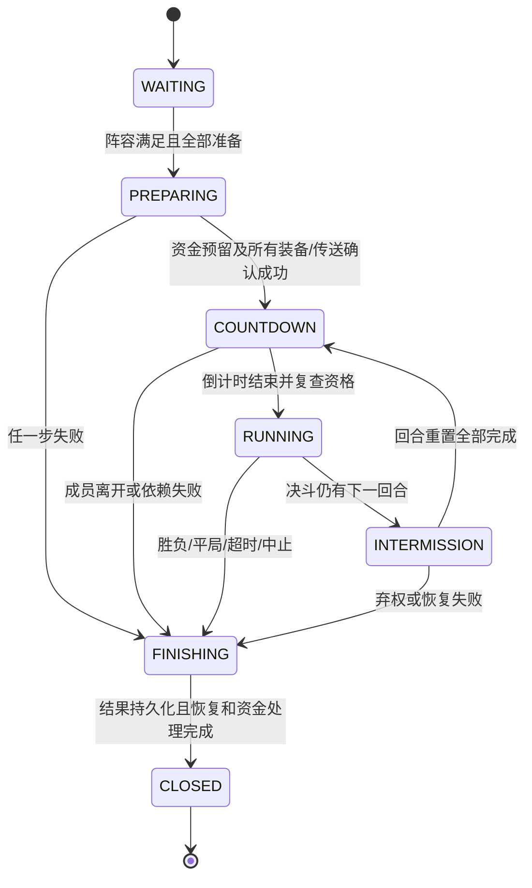

# Regions 使用体验、国际化与战斗玩法实施计划

> **2026-09-23 更新**：完成准备回执、装备恢复、跨场占位、容器保护、字段翻译及竞速／捉迷藏重启中止记录加固；380 项测试通过。实际 Lands/Folia、多人及真实崩溃恢复仍按 §10.2 验收。
> 隔离 Paper 加载／语言 v8→v11／命令重载验证已执行，详见 [本轮证据](docs/completion-2026-09-22.md)。
> 下文“代码全部完成”是历史记录，不代表通过 §10.2 的全部发布门槛；真实 Lands/Folia 与多人故障矩阵仍待完成。

> 日期：2026-09-07。状态：**M0–M1 全部、M2.1–M2.5 完成（M2.5 的进区提示冷却与存储层 revision 守卫除外），通过 `:Regions:test`（145 例，2026-09-12 补了两条权限声明用例）/ `:Regions:build`；M3–M7 的代码与自动化验证已完成，2026-09-19 又把另外七种玩法补齐到与决斗同级（见 §11），
> 合计 **365 例**，`:Regions:build` 与 `:Regions:jarGate` 通过；§10.2 的实服／真人验收**仍然全部未执行**。
> 本文依据当前源码、现有测试及本次玩家反馈制定；没有把历史验收或代码静态检查当作本轮实服验收。
> 按用户本次要求，Regions 本轮具体任务在本文件维护；根 [PLAN.md](../PLAN.md) §5.2 保留历史、总体方向与入口，不重复维护本轮任务清单。

## 1. 本轮目标与已经确定的玩法

用户已明确：**工会战按 Lands Nation（国家／领地联盟）分队；大乱斗是单命淘汰，最后存活者获胜**。

| 方向 | 本轮交付 | 完成标准 |
|---|---|---|
| 国际化 | 中文和英文覆盖全部内置页面、动态状态、错误、模板与比赛反馈 | 所有可达页面均有双语验收记录；中文普通界面不露出未翻译的内部术语、枚举或键路径 |
| 场地管理 | 玩法优先的创建向导、集中检查发布、问题直达修复、基础／高级设置 | 新场地主不用写 YAML、内部 ID 或 `key=value` 即可建立三类战斗场地；向导只有 4 个阶段 |
| 玩家参与 | 活动大厅、报名、准备、退出、观战和结果页 | 常规从大厅到准备完成最多 3 次主要操作；多 Nation 身份额外一次选队；不需记场地 ID，进入区域本身不等于同意参赛 |
| 双人 PVP | 严格 1 对 1、明确开赛／超时／弃权／平局、可选多回合 | 默认一局定胜负；三局两胜沿用同一场比赛和同一份装备托管 |
| 工会战 | 两个 Nation、固定等额阵容、队友保护、队伍淘汰胜负 | 默认 5 对 5，可配置每队 2–10 人；同 Nation 的不同 Land 成员能正确归队 |
| 大乱斗 | 新增 `free_for_all`，每人一条命，淘汰后观战或退出 | 默认 4–16 人，可把最低人数设为 2；本轮上限 16；不复活回战场，不按击杀数替代生存胜负 |
| 升级与恢复 | 修复语言迁移及半初始化关闭；统一比赛和装备恢复边界 | 旧语言升级可启动；准备失败、死亡、断线、重载、宕机均不会吞装备或重复结算 |

验收招募至少 5 名未参与开发的玩家，其中至少 2 名首次管理场地。用已有场地边界和测试点位执行任务，至少 4/5 能在没有开发者口头指导的情况下完成报名准备，至少 2 名场地主各在 10 分钟内完成创建和发布。常规 3 次操作指选择场地、报名、准备；多 Nation 选队和可选“传送到候场”分别记录额外点击。排队、移动到点位和等待其他玩家不计入 GUI 操作次数。记录实际耗时、失败节点和求助次数，不以开发者自己的熟练操作代替。

## 2. 当前实现与具体缺口

以下是源码证据，不是对所有生产环境问题的推测。路径相对本目录。

| 现状／问题 | 代码或资源位置 | 计划处理 |
|---|---|---|
| 语言基线已经是 7，但迁移计划无步骤；版本 6 启动失败 | [RegionBaseline.kt](src/main/kotlin/org/cubexmc/regions/config/RegionBaseline.kt)、[RegionBaselineTest.kt](src/test/kotlin/org/cubexmc/regions/config/RegionBaselineTest.kt) | M0 补 6→7，后续升级必须有完整迁移链 |
| `disablePlugin()` 直接访问尚未初始化的战斗等服务 | [RegionsPlugin.kt](src/main/kotlin/org/cubexmc/regions/RegionsPlugin.kt) | M0 按实际初始化状态清理，并验证中途失败 |
| 中文资源本身含 `Mode`、`Flags`、`Effects`、`Triggers & Actions`；玩法按钮名称是 `dual_pvp`、`union_war` | [zh_CN.yml](src/main/resources/lang/zh_CN.yml) | M1 统一术语和展示名称，内部配置标识保持稳定 |
| 布尔值、启动方式、玩法状态直接输出 `true`、`vote`、`idle`、`active players=…` | [RegionModeMenu.kt](src/main/kotlin/org/cubexmc/regions/gui/RegionModeMenu.kt)、[CombatModeService.kt](src/main/kotlin/org/cubexmc/regions/mode/CombatModeService.kt)，以及 Race/Round 的状态输出 | M1 引入结构化状态和按接收者渲染的标签 |
| 校验、能力参数、模板参数与服务失败原因是英文字符串，被 GUI／命令直接插入中文句子 | [RegionValidationService.kt](src/main/kotlin/org/cubexmc/regions/service/RegionValidationService.kt)、[CapabilityCatalog.kt](src/main/kotlin/org/cubexmc/regions/capability/CapabilityCatalog.kt)、[RegionTemplateService.kt](src/main/kotlin/org/cubexmc/regions/service/RegionTemplateService.kt)、[ServiceResult.kt](src/main/kotlin/org/cubexmc/regions/service/ServiceResult.kt) | M1 改为错误码、参数、字段定位和本地化修复动作 |
| 模板名称、描述及内置开赛／结束提示直接写中文，英文语言文件覆盖不到 | [templates.yml](src/main/resources/templates.yml)、[RegionCreationMenu.kt](src/main/kotlin/org/cubexmc/regions/gui/RegionCreationMenu.kt) | M1 内置模板改用语言键；自定义文本保留 |
| 当前测试检查双语键集合、英文不含中文与 MiniMessage，没有检查中文界面的英文泄漏 | [LanguageFileTest.kt](src/test/kotlin/org/cubexmc/regions/config/LanguageFileTest.kt) | M1 增加显示值、占位符和可达页面覆盖 |
| 创建先要求输入 ASCII ID 和名称；管理主页只取前 45 个场地；详情页同时摆放多种技术入口 | [RegionCreationMenu.kt](src/main/kotlin/org/cubexmc/regions/gui/RegionCreationMenu.kt)、[RegionOverviewMenu.kt](src/main/kotlin/org/cubexmc/regions/gui/RegionOverviewMenu.kt) | M2 自动 ID、任务式向导、分页筛选、基础／高级页面 |
| 已有玩法专用设置、模板预设、位置快捷设置；原始模式参数入口已经限制为超管 | [RegionModeMenu.kt](src/main/kotlin/org/cubexmc/regions/gui/RegionModeMenu.kt)、[GuiValues.kt](src/main/kotlin/org/cubexmc/regions/gui/GuiValues.kt) | 保留这些能力，继续减少认知负担，不重复重做现有功能 |
| 玩家目前主要靠进入区域入队，再执行 `game … ready`；没有专用活动大厅和完整参赛页 | [RegionsCommand.kt](src/main/kotlin/org/cubexmc/regions/command/RegionsCommand.kt)、[RegionSessionService.kt](src/main/kotlin/org/cubexmc/regions/service/RegionSessionService.kt) | M2/M3 分开区域会话与比赛报名 |
| 工会识别取所属 Land 的第一项，再取 Nation，没有 Nation 就退回 Land；比赛中实时重新算工会 | [LandsUnionProvider.kt](src/main/kotlin/org/cubexmc/regions/integration/LandsUnionProvider.kt)、`CombatModeService.unionIds` | M5 改为完整 Nation 候选、明确选队、锁定比赛阵容 |
| 决斗／工会战共用存活人数阈值结束逻辑；仅决斗模板限制 2 人，运行时默认容量不限制 | `CombatModeService.minPlayers/maxPlayers/maybeEndAfterRosterChange` | M3/M4/M5 分离启动人数、比赛容量与胜负条件 |
| 战斗服务没有完整倒计时或 `timeout-seconds` 计时实现；文档的通用“300 秒超时”不能作为其已完成证据 | [CombatModeService.kt](src/main/kotlin/org/cubexmc/regions/mode/CombatModeService.kt)、[README.md](README.md) | M3 增加实际状态机、计时器与回归测试，M7 订正文档 |
| 伤害监听处理区域 PVP 禁止规则和捉迷藏，未接完整战斗成员／队伍隔离 | [PlayerLifecycleListener.kt](src/main/kotlin/org/cubexmc/regions/listener/PlayerLifecycleListener.kt) | M3 增加参赛者、队友、观战者、局外人与阶段判定 |
| `restoreStored()` 先 `gearStore.take()` 删除持久化记录，再恢复玩家背包 | [CombatModeService.kt](src/main/kotlin/org/cubexmc/regions/mode/CombatModeService.kt)、[CombatGearStore.kt](src/main/kotlin/org/cubexmc/regions/mode/CombatGearStore.kt) | M0 修正恢复确认顺序；M3 增加崩溃恢复协议 |
| 当前注册 7 种玩法；`free_event` 是通用区域活动，没有大乱斗胜负逻辑 | [BuiltInRegionCapabilities.kt](src/main/kotlin/org/cubexmc/regions/capability/BuiltInRegionCapabilities.kt)、[RegionsPlugin.kt](src/main/kotlin/org/cubexmc/regions/RegionsPlugin.kt) | M6 独立新增 `free_for_all`，不改变 `free_event` 语义 |

上表每一行的处理都已在 M3–M6 落地：`CombatModeService` 现在只做门面，判定与状态机在 [`match/CombatMatchCoordinator.kt`](src/main/kotlin/org/cubexmc/regions/match/CombatMatchCoordinator.kt)；伤害隔离在 [`match/CombatDamagePolicy.kt`](src/main/kotlin/org/cubexmc/regions/match/CombatDamagePolicy.kt) 并接进 `PlayerLifecycleListener`；恢复顺序与崩溃恢复协议在协调器与 [`match/MatchStore.kt`](src/main/kotlin/org/cubexmc/regions/match/MatchStore.kt)；`free_for_all` 已作为第 8 种玩法注册，`free_event` 语义未变。

## 3. 保持的边界与本轮范围
1. 日常场地管理仍要求 **治理权限 `regions.admin` 且当前 Source owner**；普通 Nation 成员、国主、队长身份均不自动获得场地编辑权。超管接管和裁判开／停赛沿用独立授权与审计。
2. 场地几何仍来自 Lands Area 或已有 Cuboid。Nation 用于参赛队伍身份，不能把 Nation 的全部领地自动变成战场。
3. 所有配置通过草稿、校验预览、发布 revision 生效。简化界面不绕过这些步骤；试运行仍仅测试操作者的规则／效果，不启动正式比赛。
4. 本轮新增玩法限 `free_for_all`。不扩展 Source、跨服匹配、积分天梯、赛季、脚本、模板市场、占地攻城或 Lands 原生战争经济。
5. 装备和临时状态继续分别走装备 escrow 与 `ScopedEffectService`，不在新 Mode 里保存另一套恢复快照。新增有状态 store 实现 `Reloadable`／`Terminable` 并 `bind(store)`。
6. Lands 和 Contract 都是可选连接。内部玩法只消费本地 provider 数据；跨插件类型解析遵守 provider ClassLoader 和仓库隔离规则，不增加对另一个插件项目的编译依赖。
7. Contract 保留现有双边 WAGER；本轮不实现 Nation 成员分账，也不给大乱斗接多人押注。缺席时无奖励决斗和大乱斗可运行，Nation 战需要可用 Lands Nation 能力。

## 4. 国际化设计

### 4.1 显示语言与稳定标识分离

| 内部标识／现有英文 | 中文显示 | 英文显示 |
|---|---|---|
| Region | 场地 | Venue |
| Mode | 玩法 | Game mode |
| Flag | 场地规则 | Rules |
| Effect | 临时效果 | Temporary effects |
| Trigger / Action | 触发条件／执行动作 | Triggers / Actions |
| `dual_pvp` | 双人决斗 | Duel |
| `union_war` | 工会战（国家对战） | Nation battle |
| `free_for_all` | 大乱斗（单命淘汰） | Last player standing |
| `free_event` | 自由活动 | Free event |
| `allow / deny / pass` | 允许／禁止／沿用其他规则 | Allow / Deny / Inherit |
| `true / false` | 开启／关闭 | On / Off |
| `draft / published / frozen` | 草稿／已发布／已冻结 | Draft / Published / Frozen |
| `vote / judge` | 玩家准备后开始／裁判发令 | Player ready / Judge start |

所有已有玩法、规则、效果、触发器、组合方式、作用范围、状态、原因码均补齐同类映射。中文普通页面只显示译名；高级详情可同时显示稳定 ID，复制命令保留原 ASCII 参数。玩家名、Nation 名、世界名和管理员自定义内容不自动翻译。

### 4.2 消息数据流

- 增加 Regions 本地 `MessageRef(key, args)`、`LocalizedIssue(code, args, fieldPath, severity, fixTarget)` 和结构化 `GameStatus`。Service 只返回语义数据，不拼接给玩家看的句子；已有 `AuthorityDenial` 的键式做法可复用。
- `LanguageManager` 成为 GUI、命令、Action、比赛消息唯一呈现入口。`GuiText`、`GuiItems`、`ModeMessages` 接收 viewer／locale；广播逐接收者或按 locale 分组渲染，不能先生成一条中文字符串再发给所有人。
- `ServiceResult.reason`、`ValidationIssue.message`、`CapabilityValidationIssue.message`、模板参数错误、`FundingResult.detail` 的 UI 消费点逐项迁移。provider 详情保留在日志；玩家看到“奖励服务暂不可用，请稍后重试”及可供报障的事件编号，不能看到 Java 异常正文。
- 展示词典按 `labels.*`、`errors.*`、`game.*`、`gui.*`、`templates.*` 组织；错误中把 `min-players` 显示为“最低人数”，附“前往人数设置”按钮。字段路径仍供日志和程序定位。
- 语言策略新增 `locale-mode: server|player`，旧配置迁移后默认 `server`，保持当前服主设定。`player` 模式按玩家手动选择、客户端语言、服务器语言决定；中文客户端变体归一到 `zh_CN`，本轮只承诺 `zh_CN/en_US`。
- 玩家手动选择保存在自身 PDC，通过现有共享 PDC 能力访问；控制台使用服务器语言。解析不到的 locale 返回服务器语言，不动态改变全局 `setCurrentLocale`。
- `cubex-i18n` 已有显式 locale 的 `message/raw/rawList`，但 Component、列表和 caller-owned template 的 locale 能力不齐。需要补齐时在共享模块增加保持旧调用兼容的重载及测试，Regions 不再自己实现 MiniMessage 或回退引擎。
- 同 locale 的磁盘自定义值优先，其次 jar 内该 locale 默认值；支持语言的缺失键优先使用同语言内置文本。两个内置 locale 均缺键时记录去重告警并显示本地化通用错误；测试环境直接报失败。

### 4.3 模板与动态文本

- `templates.yml` 的内置模板增加 `name-key`、`description-key`；参数显示名和说明也使用语言键。保留自定义 `name/description` 字面量兼容读取，不能把用户内容误识别成键路径。
- 内置 `message/broadcast/title` Action 增加 `text-key/title-key/subtitle-key` 和结构化参数；每个字段的键形式与字面量形式互斥。schema、执行器、嵌套校验和预览同时支持。模板身份存 ID，页面与提示在使用时翻译。
- 旧内置模板能精确匹配历史默认内容时才转换，保留有差异的自定义文案。已经发布的历史 revision 保持原文；在“更新内置模板”时生成草稿和 diff，由场地主确认发布。
- MiniMessage 的用户输入与外部名称按普通文本参数插入；保留官方颜色等受控样式。帮助中的字面量尖括号必须转义，不能破坏真实占位符。

### 4.4 国际化验收清单

- [x] 审计所有页面：大厅、创建、来源选择、模板、详情、玩法、规则、效果、触发动作、发布、历史、诊断、报名、阵容、观战、结果。
  （2026-09-13：页面文案已全部按查看者语言渲染，术语泄漏由 `ChineseLocaleLeakTest` 覆盖；逐页**排版**检查仍需实服，见本清单最后一条。）
- [x] 审计非页面输出：help／usage／补全反馈、权限拒绝、聊天提问、取消／超时、标题、ActionBar、BossBar、比赛状态、恢复和奖励失败。
  （2026-09-13：help／权限拒绝／聊天提问／取消／比赛状态／恢复与奖励失败均走语言键；广播占位符（结束原因、奖励状态、载具名）已改为按接收者解析；ActionBar 按接收者渲染。BossBar 本轮未使用——比赛状态用 ActionBar，故无需审计。）
- [x] 双语叶键集合、值类型和占位符集合一致；所有内置能力、状态和原因码都有显示标签。
  （由 `LanguageFileTest`（键集合与 MiniMessage）、`TermLabelsTest`（能力/状态标签）、`ErrorCatalogTest`（错误码扫描 + 占位符一致）、`ChineseLocaleLeakTest` 共同门禁。）
- [x] 对渲染后的文本做英文术语／裸枚举／未解析键检查；允许名单限定插件名、PVP、复制命令、技术详情和用户内容，不能用“含 ASCII”一刀切。
  （`ChineseLocaleLeakTest` 四条用例：内部术语与未解析键路径是硬门禁，玩家段落单独查裸枚举；例外名单逐条写理由，且断言“名单里的键必须仍然存在”，避免靠删失败过关。）
- [x] 同一局中中文和英文玩家分别收到各自语言；语言重载后旧界面刷新，待处理聊天回调仍指向原任务。
  （**部分**：同局双语已达成——聊天、标题、广播与 GUI 均按接收者渲染，`GuiTextLocaleTest` 断言同一键在两个客户端语言下渲染结果不同；待处理聊天回调由 `ChatInputState` 持有原回调不受重载影响。**已补（2026-09-13）**：`/regions reload` 之后 `RegionsGui.refreshOpenMenus()` 会重绘在线玩家已打开的 Regions 菜单（`RegionsHolder` 已带重建当前页所需的全部上下文），只有模板选择／模板确认两步临时流程不自动重开，避免丢掉玩家正在输入的参数。）
- [ ] 人工逐页检查排版、换行、过长 Nation 名和占位符替换；仅有 YAML 键一致不能宣告国际化完成。

## 5. 简化流程与具体界面

### 5.1 两类入口

`/regions` 对玩家打开“活动大厅”，展示已发布且允许参与的场地；有管理资格者额外看到“我的场地”。`/regions gui` 保留管理界面含义；`/regions help` 和控制台无参数返回按权限过滤的帮助。

大厅卡片显示玩法、场地名、当前阶段、人数、能否报名、装备规则、预计时长和奖励状态。“缺少 Lands”“正在恢复上一局”“人数已满”都显示原因，不能给一个点击后无响应的灰色按钮。列表增加分页和玩法／可报名筛选，处理第 46 个及后续场地。比赛完成后返回上次列表页。

### 5.2 场地主创建：4 个阶段

| 阶段 | 操作 | 默认值与防错 |
|---|---|---|
| 1. 选玩法 | 双人决斗／工会战／大乱斗等卡片 | 一句话说明人数和胜负；依赖不可用的玩法显示原因 |
| 2. 选场地 | 当前站立的自有 Lands Area 优先，或从自有区域列表选择 | 自动生成合法、唯一、稳定 ID，例如 `arena-xxxxxx`；默认名称来自来源与玩法，可改中文名；每次继续前重查 owner |
| 3. 设必要项目 | 出场／返回点、对战出生点、装备预设、人数与时间 | “站在这里设点”；出生点必须安全且在场内，返回／观战点必须在战斗区外；只展示当前玩法必填项 |
| 4. 检查并发布 | 中文／英文规则摘要、阻断项、修复入口、发布按钮 | 自动 validate + preview；错误必须修正；再次确认时核对草稿 revision、来源所有权和依赖 |

向导状态以操作者 UUID、draft ID、预期 revision 和步骤保存；关闭 GUI 可继续，取消返回上一阶段。需输入名称时用聊天，布尔值／枚举／人数用按钮，点位用当前位置，不要求输入坐标串。现有现代与 legacy 聊天监听均保留，统一使用 `ChatInputState` 去重、取消和超时。

基础页最多突出 5 个操作：**玩法设置、场地点位、装备与人数、检查并发布、比赛管理**。高级页才显示规则组合、临时效果、触发动作、原始 ID 和完整 diff。删除、撤回发布、换模板、强制结束必须显示对象与影响后确认；普通数值修改直接保存草稿并反馈，不层层确认。

发布页的“立即修复”跳到具体字段并能返回原页。普通视图显示“最低人数：4 → 6”，高级视图显示真实字段路径。草稿被另一个管理员更新、来源转让或权限改变时，旧按钮和聊天回调拒绝写入并刷新摘要。**已完成（2026-09-13）**：详情页拆成基础页与高级页。基础页只留 5 个操作——玩法设置（含装备与人数）、场地点位、检查并发布（校验结果写进按钮说明，不再单设校验按钮）、比赛管理（聊天里给出状态／名单／结果与开停赛命令）、隔离试运行；规则组合、临时效果、触发动作、应用模板、完整 diff、历史版本、启停、清理、撤回与删除收进高级页（`View.DETAIL_ADVANCED`）。槽位与标签抽成 `RegionDetailLayout` 常数，`RegionDetailLayoutTest` 把“基础页恰好 5 个操作、两页槽位不重叠、每个标签中英双语齐备”钉住，以后加第 6 个基础按钮会直接失败。同一批还把 M2.3 的遗留补上：规则／效果／触发页从发布页跳进来时，返回键回发布页而不是回详情页。未发布修改不影响线上比赛；已有比赛锁定旧规则快照，新发布版本只供后续比赛使用。

### 5.3 玩家流程

1. 大厅选择场地，阅读单页规则；点击“报名”明确同意装备暂存、单命／回合规则、退出后果及奖励条款。
2. 到达场地入口或通过明确的“前往候场”按钮传送；传送失败时释放候场名额且不改装备。走入区域仅显示一次带冷却的参与提示，不自动报名、不自动准备。
3. 参赛页显示自己、队友／对手、准备状态和开赛条件；点击“准备”。工会战按候选 Nation 自动或手动归队，随后回到同一参赛页，不让玩家另抄队伍 ID。

比赛中用 ActionBar/BossBar 显示倒计时、存活人数和队伍／回合状态；关键事件保留聊天文本，不能只靠颜色或声音传意。准备后新增成员、切换队伍、修改比赛选项都使受影响准备状态失效。人数满足仍未准备时明确显示等待谁，不提前扣押装备。

淘汰后显示“已淘汰”，可在场外观战点继续观看或退出；本轮不依赖跨世界自由旁观传送。结果页显示胜负、自己排名／回合成绩、退出原因和恢复状态，“再来一局”重新报名并重新准备，不自动为玩家再次接受押注。

### 5.4 命令与权限落点（以下为拟新增／扩展语法）

| 入口 | 行为 | 权限与约束 |
|---|---|---|
| `/regions`、`/regions game <id> status` | 大厅／比赛状态 | `regions.use` 与拟新增 `regions.game.view`；控制台可查看状态 |
| `/regions game <id> join` | 明确报名，工会战弹选队或确认卡 | `regions.use` 与 `regions.game.join`；只能给自己报名 |
| `/regions game <id> ready`、`unready` | 准备／取消准备 | `regions.use` 与 `regions.game.ready`；只操作自己的名单记录 |
| `/regions game <id> leave` | 退报名或确认弃权 | 自己已有报名即可退出；失去参与权限也必须保留恢复／退出通道 |
| `/regions game <id> spectate` | 到配置的场外观战点 | `regions.use` 与 `regions.game.spectate`；不得干涉战局 |
| `/regions game <id> start`、`end` | 裁判发令／强制终止 | 拟新增 `regions.game.start/end` 叶节点，加场地主／该场已授权裁判／超管判定；不能跳过人数、准备、托管检查 |
| `/regions language <zh_CN|en_US|auto>` | 选择个人语言 | 拟新增 `regions.language.select`，只在玩家语言策略启用时生效 |

普通叶节点由 `regions.use.children` 提供，默认策略与现有普通参与能力保持一致；执行、GUI、help、补全使用同一判定。管理叶节点不因 `regions.use` 自动获得；裁判只获得自己被授权场地的开停赛能力。保留旧 `ready/status/start/end/stop` 行为入口和现有权限名，新增语法不顺带重命名全套历史节点。`regions.bypass.flags` 不绕过比赛成员隔离、友伤和准备阶段保护。

## 6. 三种战斗共用的比赛基础

### 6.1 数据与职责

保留 `CombatModeService` 作为现有调用方的入口，逐步委托 Regions 内部的 `CombatMatchCoordinator`；胜负规则拆为 `DuelRules`、`NationBattleRules`、`LastPlayerStandingRules`。只抽三类战斗实际共有的规则，不把 Race/Round 同时重写，也不新增有状态 shade 模块。

建议新增以下本地模型：

- `MatchSnapshot`：`matchId`、Region ID、已发布 revision、完整不可变规则、玩法、创建时间、全部报名者 UUID、队伍／Nation 身份快照、比赛选项及预定 Contract 双方映射。
- `ParticipantState`：候场、已准备、存活、淘汰、退出、待恢复、已恢复；原始完整 roster 独立于存活集合，结果不能只记录幸存者人数。
- `MatchResult`：唯一终态 ID、获胜玩家／Nation、平局或中止原因、完整成绩、强制操作者与原因、奖励处理状态。
- `MatchStore`：原子保存比赛阶段、选手快照、结果和恢复进度；只在关键转移落盘，不每 tick 保存整个文件。装备内容仍只在 `CombatGearStore` 持有，资金 lease 仍只在 `RewardFundingStore` 持有，避免三个文件各保存一份可变“真相”。

### 6.2 状态机与调度



- PREPARING 默认最多 10 秒，COUNTDOWN 默认 5 秒。两阶段都禁止伤害；任何一名玩家装备托管、状态准备或传送失败都撤销本次开赛，不让部分玩家先打。
- 锁定 roster 和规则 → 持久化比赛及资金双方映射 → 沿用同一 operation 预留 WAGER → 每名玩家持久化装备 escrow → 发装备和传送 → 收齐实体线程成功回执 → 倒计时 → 正式战斗。
- 变更集中到单一比赛协调入口；用实例／generation／matchId 拒绝旧回调，每名选手另有一次性操作标识。Folia 不从全局线程读取或改玩家背包、位置、生命值；实体任务回传值快照，比赛状态读取不能跨线程直接碰 Bukkit 实体。
- PREPARING 或 COUNTDOWN 失败进入统一清理，再允许重新报名；RUNNING 的超时、死亡、退出、管理员操作都走同一个终结入口，只记录／发奖一次。
- 成员变化后若可能产生胜者，启用 200 毫秒结算观察窗口，继续汇总已经发生的死亡／退出，然后判定；用单调时钟和有序事件队列测试，不能依赖不同 Folia 区域同 tick 完成。
- `FINISHING` 显示尚待恢复人数及资金状态；未完成的上一局阻止同场新局。离线选手保留 escrow 并在登录恢复，不能靠删除记录“解锁”。其他场地不受此恢复状态阻塞。
- 重载／正常停服／崩溃重启后中止未完成比赛并恢复，不自动续打半局。已落盘的自然胜负继续原结算；胜负尚未确定的中断不臆造胜者，走退款／待复核。

### 6.3 伤害、死亡与装备

1. 同一场、同一运行阶段、双方均存活才可能放行 PVP；不同比赛、候场者、观战者、局外人对参赛者的伤害及反向伤害均拒绝。比赛内部保护不受场地 Flag bypass 影响。
2. 工会战同队永远禁止友伤，本轮不提供开关；决斗和大乱斗按本局规则互为对手，不按 Lands 全局友好关系自动结盟。包含近战、箭矢、三叉戟、宠物归属、药水／范围效果与有归属的爆炸。无法安全判定来源的外部玩家影响默认拒绝。
3. 尊重其他插件已取消的伤害，不在通用监听器里强行取消 `cancelled` 状态。Lands 的场地 PVP 与联盟保护冲突必须在集成验证中解决；无可靠局部授权能力时阻止相关对局开赛并指出需要调整的专用场地规则，禁止修改全服外交或战争关系。
4. 环境死亡同样淘汰；只对有效同局攻击记录击杀展示。大乱斗击杀数仅为统计，不能覆盖存活胜负。重复死亡／quit／kick 回调只处理一次。
5. 淘汰选手不通过原有区域检测自动重新入队。重生流程先进入出场／观战恢复路径；决斗下一回合是同一 match 的明确重置，不走大厅重新报名。
6. 默认三种模板都使用统一装备并在开赛前说明；自带装备列为高级选项，必须明确死亡掉落与损耗策略并有独立验收后才开放。模板内禁止丢弃、拾取和通过容器／快捷键转移临时装备，检查死亡掉落、经验、`keepInventory`、副手与宠物取物路径。
7. 恢复先读取 escrow、在玩家所属线程写入完整快照并确认，再删除对应记录；失败保留。恢复中的玩家不能移动物品或加入新局。M3 明确实现 `RESTORING → 玩家快照和恢复 operation 标记持久化 → 删除对应 escrow → 解除限制`：在已验证的服务端线程上保存玩家数据，恢复 operation 标记与玩家背包一同落盘，重启发现该 operation 已完成时只补清理记录、不覆盖新背包。若持久化完成状态无法确认则保留待恢复，不直接解锁。恢复用覆盖快照而非 addItem，并对每个写盘边界注入中断，验证不会覆盖玩家恢复后合法获得的新物品。
8. 必须列明并覆盖比赛会修改的状态：物品及物品元数据、护甲、副手、经验、游戏模式、生命／饥饿等；临时属性与药水仍通过 Effect lease。新增快照字段带版本迁移，不丢旧装备记录。

## 7. 三类模式的确定规则

### 7.1 双人决斗 `dual_pvp`

| 项目 | 本轮规则 |
|---|---|
| 阵容 | 恰好 2 人；服务层强制容量，第三人只能排候选队列或观战，不只依靠模板写 `max-players: 2` |
| 入场 | 两人分别站到 A/B 出生点；相互确认后统一 5 秒倒计时 |
| 赛制 | 默认 BO1；可选 BO3（先赢两回合），回合间休整 5 秒 |
| 时间 | 每回合默认 180 秒；超时仍双方存活，该回合平局；BO3 最多 5 个实际回合，仍未达到两胜则整场平局 |
| 胜负 | 对手死亡／有效弃权且自己仍存活则赢该回合；观察窗口内双方均死亡算回合平局 |
| 弃权 | 正式开始后的主动离场超过 5 秒、传送离开或断线视为整场弃权；报名页明确说明；不提供可用于躲伤害的自动暂停重连 |
| 异常 | 裁判强停、服务器关停、场地冻结和集成错误为中止，不按单方弃权发钱 |
| 托管 | 开赛前保存一次原装备；回合之间只重置比赛装备与状态；整场结束恢复一次，WAGER 只按整场结算 |
| 结果 | 显示对手、比分、胜负原因、用时、装备恢复与奖励状态；未准备的新一局不能复用已结算 WAGER |

出生点安全、距离和场内检查属于发布与开赛双重校验。裁判不能在只有一名玩家时强行开始，也不能为自己的押注直接手填胜者。

### 7.2 工会战 `union_war`：两个 Lands Nation 对战

**Nation 身份解析**：枚举玩家拥有或加入的所有 Land，获取非空 Nation，以稳定 Nation ID 去重。只有一个候选时自动选择并展示确认；多个候选时让玩家明确选择；没有 Nation 时拒绝报名并解释“需要加入属于国家的领地”。不能使用 `firstOrNull()` 或把独立 Land 自动当成 Nation。

官方 API 的 `OfflinePlayer.getLands()` 表示玩家拥有或加入的全部 Land，`Land.getNation()` 允许为空，`MemberHolder.getULID()` 提供稳定标识。这支持上述解析路线；实际生产 Lands 版本、线程约束和具体反射签名仍须在 M5 的集成任务中验证。[所属领地 API](https://raw.githubusercontent.com/IncrediblePlugins/LandsAPI/main/src/main/java/me/angeschossen/lands/api/player/OfflinePlayer.java)、[Land API](https://raw.githubusercontent.com/IncrediblePlugins/LandsAPI/main/src/main/java/me/angeschossen/lands/api/land/Land.java)、[成员组织 API](https://raw.githubusercontent.com/IncrediblePlugins/LandsAPI/main/src/main/java/me/angeschossen/lands/api/memberholder/MemberHolder.java)。

| 项目 | 本轮规则 |
|---|---|
| 对阵 | 固定两个不同 Nation；开报名时由场地主选择本场双方，下一场可选其他双方；此项属于比赛选项，不修改已发布的场地规则 |
| 名单 | 默认每队 5 人，发布设置允许每队 2–10 人；双方必须达到相同的规定人数且全部准备，候补不自动入场 |
| 组织资格 | 玩家从完整候选中选择参战 Nation；加入、准备、锁阵容和开赛前复核；一个 UUID 在本场只能属于一队 |
| 队长 | 从该 Nation 已报名成员中指定一位仅负责查看／确认阵容的队长；不能替别人准备，不能编辑场地、代扣资金或提前发奖；首版不增加通用协作者权限系统 |
| 外交 | 默认“约战”：双方确认即可；高级 `enemy-only` 要求两个 Nation 在 Lands 中满足已验证的敌对关系。不得自动宣战、解盟或占领土地 |
| 场地 | 各队独立安全出生点集合；显示 A/B 标识、队伍名与成员列表，颜色仅作辅助 |
| 胜负 | 单局、每人一条命；一队所有成员淘汰／弃权且另一队仍有存活者，则另一 Nation 获胜。双方同归于尽为平局 |
| 时间 | 默认 600 秒；超时仍双方存活则平局，不用最低开赛人数阈值提前结束，也不凭剩余人数直接发奖励 |
| 成员变动 | COUNTDOWN 前失去 Nation 资格退回报名并重查；RUNNING 后改名／退国／换国不改本局锁定队伍和收款映射，只影响下一场。禁止中途替补 |
| 依赖异常 | API 查询失败与“无 Nation”分开表示；Lands 不可用或组织解散无法验证时中止并清理；不降级成个人战或免费战 |

**集成改动**：扩展 `UnionProvider` 支持完整候选、稳定 ID、可用性原因和指定组织关系查询；为 Nation 战采用显式 `team-unit: nation`。保留非战斗调用方的既有语义，不能全局悄悄改变 `getUnion()` 使条件或历史奖励映射变义。通过 provider 生命周期失效缓存，只保存 ID 和值快照到 match，不把 Lands 对象持有到 reload 后。

**奖励兼容**：开赛前确认 WAGER 的两个个人签署方分别唯一映射到本场两个 Nation，保存 `Nation ID → Contract party UUID` 和完整 match 证据；赢的是 Nation，收款仍是该 Nation 对应的合同签署人。不是自动给国库或全体成员分账。比赛后退出 Nation、改名或换届不能改变收款人；旧 funding lease 证据不足时沿用原 operation 进入待复核，不能按当前成员关系猜测并付款。

### 7.3 大乱斗 `free_for_all`：单命淘汰

| 项目 | 本轮规则 |
|---|---|
| 阵容 | 默认最低 4、最多 16 人；最低可设 2；每名玩家独立，无 Nation 队伍或同国免伤 |
| 开始 | 全员准备、随机分配不重复出生点、统一装备、5 秒倒计时；开赛后停止补人 |
| 生命 | 每人一条命；死亡、主动传送离开、正式战斗中断线或越界持续 5 秒即淘汰；重连只能恢复与观战 |
| 胜负 | 最后一个存活者获胜；观察窗口内无存活者则平局；击杀数不参与冠军判定 |
| 时间 | 默认 600 秒上限；到时仍多人生存则平局并展示存活名单。缩圈和突然死亡不进入首批，避免引入世界边界与外部领地副作用 |
| 排名 | 按淘汰顺序反向展示；同一结算批次淘汰为并列；仍存活但超时者为并列存活，不伪造唯一冠军 |
| 点位 | 出生点数至少等于上限人数且不重复；默认建议间隔至少 6 格，安全性必须逐点校验；不足时指向“补充出生点” |
| 观战 | 淘汰玩家进入配置的场外观战点，不能伤害、拾取、投掷物品或触发战斗动作；可随时退出并恢复 |
| 奖励 | 首版只有结果与非资金统计；`reward-source: contract` 在该模式校验时明确拒绝，不能静默忽略 |

新增时同时更新玩法 registry、capability descriptor、参数 schema、校验器、Mode dispatch、重叠规则、模板、双语文案、GUI、命令补全及回归用例。`free_event` 和其他 7 个玩法保留原本含义；大乱斗不能只加一个能显示但无法运行的按钮。

## 8. 升级、数据兼容与部署

1. **先补缺失的 6→7 语言迁移**：按两种语言各自历史默认资源补缺键、转换已改变结构，保留服主自定义值和未知键。具体包括新增 `gui.detail.apply-template`、`gui.template.confirm` 等，并将旧 `gui.template.entry.lore` 最后的“创建”提示转换为 `create-hint`，补 `apply-hint`；只对匹配历史默认的列表自动变换，有自定义列表则保留并给出说明。迁移前备份，失败不改版本号和原文件，重复启动幂等。删除“所有迁移步骤必须为空”的旧断言。
2. 新国际化版本通过单向链继续升级，不把所有旧文件假装成最新版。计划中的 `locale-mode`、模板语言键、Nation 分队及新增快照字段分别按实际存储格式调整 `config-version/templates-version/regions-version/escrow-version`；确定目标时一并提交迁移、资源、测试。现有事实基线为 config 4、regions 4、templates 1、lang 7；根计划的历史 lang 4 不作为实现依据。
3. 增加 `MatchStore` schema 1；它保存比赛恢复元数据，不复制物品或余额。`CombatGearStore` 和 funding lease 的旧记录必须先能读回；旧装备记录不能因缺新 matchId 而被丢弃。
4. 旧决斗不是严格 2 人、旧工会战使用 Land／多队或缺新点位时，保留历史与草稿，生成可检查的升级草稿并标记“需要完善设置”；阻止该场新比赛直到确认发布。不要在后台静默改变线上胜负规则，不让单个旧场地配置错误阻止整个插件启动。
5. 内置模板更新不覆盖用户自定义模板，也不原地改历史 revision。向导展示“保留现状／生成升级草稿”的具体 diff。新模式和破坏性语义通过独立候选版本逐项开启。
6. 构建加入可识别的插件版本／提交信息，避免所有部署长期只有 `0.1.0`；发布记录说明旧 jar、新 jar、数据基线和迁移结果。
7. 回退先停止新报名、结束／恢复比赛并处理 funding lease，再备份并停服更换 jar。旧 jar 无法读新格式时使用与旧 jar 配套的完整备份；不能只回退语言文件，也不能删除 escrow／funding 数据。

## 9. 实施批次、代码落点与完成条件

估算为单名熟悉仓库的开发者有效工作日，包含对应自动化验证，不含等待实服多人集合。每批先交付可验证行为，再进入依赖它的批次；不要在一个提交中混入无关重构、玩法变化和整套文案调整。

| 批次 | 依赖 | 工作量 | 代码落点与具体交付 | 退出条件 |
|---|---|---|---|---|
| M0 启动与恢复修复 | 无 | 2–3 日 | `RegionBaseline` 补语言迁移；`RegionsPlugin.disablePlugin` 处理半初始化；`CombatGearStore` 增加读取／确认删除并修正恢复顺序 | 6→7 保留自定义文本、双语可启动；多阶段启用失败不再二次报错；恢复写入失败保留 escrow |
| M1 国际化闭环 | M0 | 4–6 日 | `LanguageManager/GuiText/GuiItems/ModeMessages`；Service/validation/capability 错误；双语资源及模板；必要的共享 i18n locale 重载 | §4 全部检查通过；中英文页面、内置模板动作与动态状态无遗漏 |
| M2 入口与创建流程 | M1 | 4–6 日 | 新 `ActivityLobbyMenu`、`CreationWizard`、`GameLobbyMenu`；重整 Overview/Creation/Mode/Publish；分页；错误修复跳转；命令／权限 | 4 阶段创建可用；玩家大厅具备报名 UI，M3 未接通前不展示伪成功；旧管理入口可用 |
| M3 战斗共同基础 | M0/M1 | 5–8 日 | Match 模型、协调器、MatchStore、Combat facade、Session dispatch、伤害策略、装备准备屏障、计时与恢复 | 状态机、线程模型、成员隔离、重复事件及关键落盘故障全部通过；M2 报名准备端到端接通 **（代码与自动化验证完成，见 §9 勾选项；实服故障注入属 §10.2）** |
| M4 双人决斗 | M2/M3 | 2–4 日 | `DuelRules`、专用设置、A/B 点位、BO1/BO3、比分结果与 WAGER 整场结算 | 2 人限制、平局、超时、弃权、多回合装备及资金只终结一次 **（规则与状态机自动化通过；真人双人局属 §10.2）** |
| M5 Nation 工会战 | M2/M3 | 4–6 日 | `LandsUnionProvider/UnionProvider`、Nation 候选与队伍快照、`NationBattleRules`、友伤规则、funding 身份快照 | 实际 Lands 上 2 Nation 各多 Land 正确归队；满额等队开赛；断依赖、换国和重放付款无错队／错付 **（候选解析、身份锁定与付款映射已完成并单测；真实 Lands 归队属 §10.2 环境 B）** |
| M6 单命大乱斗 | M2/M3/M4 | 3–5 日 | `LastPlayerStandingRules`、`free_for_all` 注册全链路、出生点管理、并列排名与观战 | 2/4/16 人场景与同归于尽、环境死亡、重连不可复活通过；无多人资金入口 **（规则、注册链与校验自动化通过；多人实服场景属 §10.2）** |
| M7 全流程验收与交付 | M4/M5/M6 | 3–5 日 | 真人验收、旧数据升级、Paper/Purpur/Folia 验证；README、CHANGELOG、架构及兼容说明更新 | §10 全部通过，记录最终 jar 与环境；候选服玩家可独立完成目标任务 **（文档与自动化门槛完成；§10.2 实服／真人项未执行，所以本批尚未收口）** |

总体约 **27–43 个有效开发日**，是本方案粒度下的初始估算。M5 开始先用一个小任务核实实际 Lands 版本和 PVP 保护交互，再确定该批剩余工作量；不要把无法验证的第三方 API 能力算作已支持。

各批建议拆成以下可追踪任务：

- [x] M0.1 语言 6→7 迁移与幂等测试；M0.2 启用失败关闭；M0.3 装备恢复顺序与故障注入。
  （2026-09-07 落地：`LangV6ToV7Step` 补 6→7 迁移、保留自定义与未知键并告警，`RegionBaselineTest` 旧"steps 为空"断言替换为迁移步骤断言，新增 `LangV6ToV7MigrationTest`；`RegionsPlugin.disablePlugin` 改走可空字段按实际初始化清理（`runShutdownCleanup`），新增 `RegionsPluginLifecycleTest`；`CombatGearStore` 增加 `peek`、恢复改为"先写背包、确认成功再 `take` 删除"，新增 `CombatGearRestoreTest`。实服侧验证仍属 M7。）
- [x] M1.1 术语／键清单；M1.2 错误与状态结构化；M1.3 模板动作语言键；M1.4 locale 全链路；M1.5 全页面双语检查。
  （2026-09-13：M1.1–M1.5 全部收口，见各自条目。）
  （2026-09-07 部分：M1.1 完成——双语 `labels.*` 词典（source/mode/flag/effect/action/condition/trigger/start-mode/severity/state/counter/field）、`LanguageManager.label`、`GuiText.boolDisplay/enumDisplay`，`RegionModeMenu` 布尔与启动方式不再裸显 `true`/`vote`，新增 `TermLabelsTest` 按 `CapabilityCatalog` 全量 ID 断言双语标签，`on`/`off` 键按 YAML 1.1 需加引号；M1.2 完成状态一半——新增 `GamePhase`/`GameStatus` 与 `gameStatusLine` 渲染，三个 mode service 的 `status()` 不再输出 "idle"/"active players=…" 英文串，命令与 `ModeLifecycleServiceTest` 改用结构化断言。）
- [x] M1.2 错误结构化（2026-09-07 完成校验面）：`ValidationIssue`/`CapabilityValidationIssue` 增加 `code`/`args`/`fieldPath`（英文 `message` 降级为日志诊断，不进玩家界面）；CapabilityCatalog（10 处）、RegionValidationService（29 处）、RegionOverlapResolver（4 处）、RegionPublishingService（5 处）构造点全部带稳定错误码；`LanguageManager.issueLine`（`errors.<code>` + `labels.field.*` 字段译名，缺键回退诊断句）与 `severityLabel`；RegionsCommand/RegionOverviewMenu/RegionPublishMenu 的校验与诊断输出改走结构化渲染；双语 `errors.*` 49 键；新增 `ErrorCatalogTest` 断言全码双语覆盖与占位符一致。**尾项已于 2026-09-13 收口**：`ServiceResult.reason` 与 `FundingResult.detail` 按设计继续保存英文诊断，但**只进日志**——所有玩家可见出口都经 `LanguageManager.resultReason(code, args, reason)` 渲染。`RegionPublishingService` 把 issues 拼进 reason 的两处已改成 `publish-blocked` + 数量参数（诊断串仍留给日志），`RegionsCommand` 的 audit 行改走 `labels.reason.*`。本轮补齐了最后三处漏网点：`RegionOverviewMenu` 的撤回失败／试运行失败／删除失败把 `result.reason` **原样**塞进玩家消息，现在同样过 `resultReason`；并新增源码扫描用例（`ErrorCatalogTest`）钉住这条不变量，`event.reason`（审计操作码，本身走词典）在允许名单里。
- [x] M1.3 模板动作语言键（2026-09-07 完成）：`RegionTemplate` 增加 `nameKey`/`descriptionKey`，解析强制键/字面量互斥（同字段并存则整个模板拒载）；`message/broadcast/title` 动作支持 `text-key/title-key/subtitle-key`，执行器经 `actionText` 键优先解析，schema 描述符补 `*-key` 参数并把 required 让位给"二选一"规则，`RegionValidationService.validateTextAction` 校验互斥（`action-text-conflict`）与必填（`action-text-required`）；`TemplatesV1ToV2Step` 只转换精确匹配历史默认的内置模板字段（templates-version 1→2），自定义模板/文案保留；内置 `templates.yml` 已转为键形式；双语 `templates.*` 31 键（legacy `&` 码转 MiniMessage）；GUI 三处消费点经 `templateDisplayName/Description` 翻译；新增 `TemplatesV1ToV2MigrationTest`。触发块 `name`（"入场提示"等）本轮未键化，随 M1.5 一并处理。
- [x] M1.4 locale 全链路（2026-09-07 主体完成，2026-09-13 收口）：`cubex-i18n` 补 `component/messageList/componentList/send` 的显式 locale 重载（旧签名全部委托新实现，行为不变；模块无测试源集，回归经 Regions 套件）；Regions 新增顶层配置 `locale-mode: server|player`（旧配置缺键默认 server，无需版本迁移）；`LanguageManager` 增加 `localeFor`（player 模式按"玩家 PDC 手动选择 → 客户端语言归一（zh*→zh_CN、en*→en_US，纯函数可测）→ 服务器语言"）、`messageFor`、`setPlayerLocale/playerSelectedLocale`，`send/sendPlain` 改为按接收者 locale 渲染（控制台与 server 模式行为不变）；新增 `/regions language <zh_CN|en_US|auto>`（权限 `regions.language.select`，仅 player 模式生效，auto 清除 PDC，双语提示与根补全）。**两半均已完成**：比赛广播改为 key+args 逐接收者解析（M1.5），GUI 菜单接 viewer locale（2026-09-13）——`GuiText`/`GuiItems` 的取文案方法全部要求传 viewer（**删掉无 viewer 的重载，让编译器钉住每一个调用点**），共转换 287 处调用；`LanguageManager` 增加 `componentFor/messageListFor/labelFor/severityLabelFor/issueLineFor/resultReasonFor`（都建在既有显式 locale 的 `I18nService` 重载上，旧签名保留并委托），`gameStatusLine(viewer, status)` 与 `templateDisplayName/Description(template, viewer)` 同样补了 viewer 版本。`locale-mode: server`（默认）行为完全不变。新增 `GuiTextLocaleTest`（4 例，用真实 `LanguageManager` + 两个不同客户端语言的 Player，断言**渲染结果**不同而不只是"调用转了"）。**两处明确保留服务器语言**：①控制台/命令侧不需要 viewer 的输出（`/regions status` 已改为按执行者渲染）；②`ChatInputState` 的取消关键词是**输入匹配**不是展示文本，且其 `cancelKeywords` 是无玩家身份的 `() -> Collection<String>`，要按玩家解析得改 `modules/cubex-gui`，超出 Regions 范围。另外向导自动生成的场地**名称**刻意用服务器语言：它是要落盘并被所有管理员看到的稳定数据（§4.2），不该随创建者客户端语言漂移。`cubex-i18n` 的 `render`（caller-owned template）保持 locale 无关。
- [x] M1.5 全页面双语检查（2026-09-13 收口）：三个 mode service 约 45 处 `sendGame/broadcast` 全部改为 key+args 直传，`sendGame(recipient, key, args)` 与三个 `broadcast(state, key, args)` 在接收者所属线程用 `messageFor` 解析——同一局中中文/英文玩家各收各的语言（验收项"同一局双语"达成）；`startRequirementMessage`/`raceStateMessage` 改返回 key+args 对；audit 行操作原因经 `labels.reason.*` 显示。**本轮补完的三项遗留**：(1) **占位符值延迟解析**：新增 `GameArg`（字面量 / 语言键）与 `sendGameLocalized`，比赛播报里的结束原因、奖励状态、回合原因，以及赛跑的载具显示名改为按接收者各自解析——此前这些值是服务器语言，中英玩家同局会互相看到对方的语言；(2) **剩余 29 处英文诊断补码**：`ScopedEffectService`（14）、`RegionLifecycleService`（5）、`RegionTrialService`（3）、`RegionRegistry`（3）全部改走 `failCoded` 并补齐双语 `errors.*`，同时补上 M1.3 遗漏的 `action-text-conflict`/`action-text-required` 文案；剩下仍用 `fail(reason)` 的只有 AuthorityDenial 约定（reason 本身就是语言键，`resultReason` 走词典）；(3) **英文术语泄漏自动化检查**：新增 `ChineseLocaleLeakTest`（内部术语、未解析键路径两条硬门禁 + 玩家段落的裸枚举检查，例外名单逐条写理由且"名单里的键必须仍然存在"）；`ErrorCatalogTest` 的错误码清单改为**从源码扫描**而不是手工数组——手工清单只能证明"我列的那些还在"，`action-text-*` 与 effect/lifecycle/trial 的 17 个码就是这么漏掉的。**达成**：zh_CN 不再出现 Mode／Flag(s)／Effect(s)／Trigger(s)／Action(s) 等内部术语（玩法页卡名、规则页、效果页、触发页、模板页、发布页全部改译名，稳定 ID 只在高级页以括号保留）。**未完成**：(4) 人工逐页排版检查（需实服，属 M7）。触发块 `name` 定性为模板作者内容，不键化。
- [x] M2.1 玩家活动大厅（2026-09-07 完成）：`/regions` 无参数对玩家打开 `ActivityLobbyMenu`（管理入口保持 `/regions gui`，管理资格者大厅内有"我的场地"按钮）；只列已发布且启用的场地，卡片显示玩法译名、场地名与结构化状态行；可报名判定抽为纯逻辑 `ActivityLobbyLogic`（依赖缺失/工会来源不可用/正在恢复/进行中/满员均显示原因码，缺依赖优先），"我的场地"显隐用 `RegionsGui.canEnterManagementSilent`；45/页分页覆盖第 46 个及以后场地，卡片点击给出"走入场地报名 + ready 命令"的如实指引（M3 未接通前不展示伪成功）；`CombatModeService.isEnding` 暴露恢复窗口状态；新增 `ActivityLobbyLogicTest`（分页 45/46/91、五类原因、满员依赖 max-players、原因优先级）。**已完成（2026-09-13 补齐后两项）**：比赛完成后返回上次列表页（报名页带回来源页码与筛选条件）；玩法／可报名筛选器落地为纯逻辑 `LobbyFilter` + `ActivityLobbyLogic.applyFilter/availableModes`：筛选按钮按"全部 → 出现的每个玩法 → 全部"循环，另有"只看可报名"开关与"清除筛选"，切换后回到第 1 页（否则会停在已经不存在的页码上），筛选后无结果时给专门的空态提示；`ActivityLobbyLogicTest` 覆盖筛选顺序、叠加条件、循环边界与模式清单稳定性。
- [x] M2.2 创建向导（2026-09-07 基础完成，2026-09-13 补齐阶段 3）：阶段 1"选玩法"落地为 `View.WIZARD_MODE`（7 张玩法卡各带一句人数/胜负说明，工会战在工会来源不可用时显示依赖原因）；`WizardDrafts` 以操作者 UUID 保存进行中的向导（关闭 GUI 后 `/regions create` 或大厅创建按钮继续），草稿在草稿创建成功后清除；阶段 2 选定地块时由 `AutoRegionId` 自动生成 `arena-xxxxxx`（命中 ID 规则、避让已占用），默认名称取"玩法译名 · land/area"，**不再要求手写 ASCII ID**；`/regions create` 无参数与"我的场地→创建"按钮都进入向导，旧的 `create <id> <name>` 语法保留。新增 `CreationWizardTest`（ID 规则与避让、草稿按操作者隔离/覆盖/清除）。**已完成（2026-09-13 补齐）**：新增阶段 3 `View.WIZARD_SETTINGS`／`openWizardSettings`——只画当前玩法真正需要的格子（返回／观战点、出生点、工会战的乙方出生点、装备预设、人数、时限），每格"站在这里设点"或在页面内循环调值，顶部如实写出"必填项 N/M"与还缺哪几项，缺项时不放行到发布页并说明缺什么；`WizardRequiredFields` 是纯函数（`CreationWizardTest` 覆盖决斗/工会战/自由活动/配置齐全四种情形）。**返回上一阶段**：阶段 3 的返回键回选玩法或选地块（按进入路径），选地块页回玩法页。**名称修改聊天入口**：阶段 3 有"修改名称"，走既有 `ChatInputState` 去重链路。向导状态扩为 `WizardDraft(modeType, stage, regionId, revision)`：阶段 2 完成即记住草稿 ID 与期望 revision，`/regions create` 无参数时直接回到该阶段；阶段 3 每次保存都带期望 revision，**别人改过草稿就拒绝写入并刷新**（与 M2.5 的并发守卫同一条链路）。阶段 4 的修复跳转已由 M2.3 落地。
- [x] M2.3 检查发布与修复跳转（2026-09-07 完成）：发布页每条校验项独立成可点击条目（红/黄区分错误与警告，名称按严重级译名），点击经 `PublishFixTarget` 错误码映射跳到对应设置页（玩法值/参数→模式页、规则→规则页、效果/药水→效果页、触发/条件/动作/音效→触发页、来源→来源页）；跳到模式页时 holder 携带 `returnToPublish`，模式页返回键直接回到发布页（形成修复闭环）；无页面内修复入口的码（依赖、重叠、资金、控制台命令、区域身份）不显示跳转提示；`PublishFixTargetTest` 22 个错误码映射全覆盖。**已补（2026-09-13）**：规则/效果/触发页也带 `returnToPublish`，从发布页跳进去修完后返回键直接回发布页；过期 revision/来源转让时旧点击的拒绝写入已由各页 open 时重查覆盖，聊天回调去重归 M2.5。
- [x] M2.4 比赛报名页（2026-09-07 完成）：大厅卡片点击进入 `GameLobbyMenu` 单页报名页（可报名的场地才可进入，其余卡片仍显示原因），展示场地状态、单页规则摘要（装备托管/自带条款按 replace-gear/kit/armor 判定、单命对决/工会战/回合制/时限/最低人数按玩法生成，纯逻辑 `GameLobbyRules` 可测）、"准备"按钮（复用 `/regions game ready` 同一服务链路，服务如实报告"未入场/已开局"，M3 前不展示伪成功）、"前往参加"指引与返回大厅（带来源页码）。双语 `gui.game.*` 键。新增 `GameLobbyRulesTest` 5 用例。**已完成 / 有意取舍**：参赛者名单页已由 M3 落地（报名页顶部列出全部选手与各自状态）；走入区域的一次性冷却提示由 M2.5/M3 落地。**"报名同意条款的显式确认步骤"有意不做**：§1 的完成标准是"常规从大厅到准备完成最多 3 次主要操作"（选场地、报名、准备），再加一次确认点击就变成 4 次；§5.3.1 要求的是"阅读单页规则；点击'报名'明确同意装备暂存、单命／回合规则、退出后果及奖励条款"，当前设计就是规则摘要与报名按钮同页、点报名即同意，符合该条。如果以后要加确认，应作为服主可配项而不是默认步骤。
- [x] M2.5 权限、聊天与旧界面失效（2026-09-07 完成权限面）：`plugin.yml` 新增普通参与叶节点 `regions.game.view/ready` 与 `regions.language.select`（全部挂在 `regions.use` children 下，默认策略与现状一致），管理叶节点 `regions.game.start/end` 只挂 `regions.admin`、不随 `regions.use` 获得；`game` 子命令的 status/ready/start/end 分别接叶节点检查（`has()` 的场地主/超管判定保留，旧行为入口与权限名不动），**修正（2026-09-12）**：本批曾一并声明 `regions.game.join` / `regions.game.spectate` 作为 M3 预留，后来删掉了 —— 声明了却没人检查的权限是假承诺，服主会拿它去配权限插件（与 `f87d915` 清死节点同一条纪律）；M3 接通报名/观战时连同实现一起加回来。另外 `regions.language.select` 当时只出现在 children 里、没有自己的声明，已补。**聊天去重已就绪**：`cubex-gui` 的 `ChatInputState`（11 单测）已统一现代/legacy 双监听的注册、取消与超时，本批无需改动。新增 `GamePermissionsTest`（普通叶随 use、管理叶不随 use、旧名保留）。**未完成**：走入区域的一次性带冷却参与提示（需动 RegionDetection 管线，随 M3 报名链路一起做）；存储层对并发草稿写入的 revision 守卫（现状各页打开时重查，深水区改动随 M3 MatchStore 一并设计）。
  - （2026-09-13 **两项遗留均已关闭**：走入区域现在只发一次带冷却的报名提示（`modes.entry-prompt-cooldown-seconds`，默认 60 秒），进入不再等于报名，真正的报名走 `join`；并发草稿写入新增乐观并发守卫——`RegionPublishingService.saveDraft(sender, candidate, expectedRevision)` 与 `publish(sender, regionId, expectedRevision)`，GUI 保存传"页面渲染时的那一版"、发布确认传预览页展示的 revision，不一致就拒绝写入并提示刷新（`errors.draft-revision-stale` / `errors.publish-preview-stale`），聊天回调因此不会覆盖别人的修改，也不会发布操作者没预览过的草稿；新增 `RegionPublishingServiceTest` 三条用例覆盖陈旧写入被拒、同 revision 写入成功、发布前草稿被改。）
  - （2026-09-07 收尾：`ServiceResult` 增加可选 `code`/`args` 与 `failCoded`，`reason` 保留为日志诊断；`LanguageManager.resultReason` 渲染——有码走 `errors.<code>`，无码但 reason 本身是语言键（AuthorityDenial 约定）走词典，否则回退诊断句；RegionPublishingService 全部 12 处 fail 接上错误码（含两处 issues 拼接改为 `publish-blocked` + 数量参数、诊断串保留），RegionsCommand 13 处 / RegionsGui / RegionPublishMenu 的 `<reason>` 消费点统一走 `resultReason`；发布依赖的 detail 改为稳定码（`labels.dependency.enabled/missing` 双语显示）。双语 `errors.*` 共 57 键。**遗留长尾**：ScopedEffectService(14)/RegionLifecycleService(8)/RegionTrialService(4)/RegionRegistry(3) 的 fail 仍是英文诊断（运行时回退显示原文，行为不劣于改造前），随 M1.5 全页面审计逐个补码；RegionsCommand 的 audit 行 `" reason=$it"` 显示内部操作原因码，同样挂到 M1.5。）
- [x] M2.1 普通玩家／管理入口与分页；M2.2 创建向导；M2.3 检查发布与修复跳转；M2.4 比赛报名页；M2.5 权限、聊天与旧界面失效处理。
- [x] M3.0 把 `regions.game.join` / `regions.game.spectate` 连实现一起加回 `plugin.yml`（并同步 `GamePermissionsTest` 的叶节点集合）；M3.1 比赛状态及持久化；M3.2 PREPARING 回执屏障；M3.3 成员与伤害隔离；M3.4 死亡／退出／恢复；M3.5 资金终态及重放。
  （2026-09-13 落地：新增 `org.cubexmc.regions.match` 包——`MatchModels`（阶段/选手状态/终态/快照）、`MatchRules`（三类玩法规则）、`CombatMatchCoordinator`（状态机与恢复）、`CombatDamagePolicy`（纯判定矩阵）、`MatchSpawns`（点位解析与校验）、`MatchStore`（`matches.yml`，schema 1）、`GearSnapshot`；`CombatModeService` 改为门面并保留原公开入口，新增 `join/leave/unready/spectate/selectTeams/participants/result/membership/damageDecision/recoverPersisted/tick/onDisconnect`。准备屏障逐人"落盘 escrow → 发装备与传送 → 回执"，任一人失败整体撤销并交还已托管装备；恢复改为"读 escrow → 写回背包 → 确认落盘 → 再删记录"，重启时已确认的 operation 只补清理、不覆盖新背包；重启中止未完成比赛并退款，不续打半局。伤害只允许同局、RUNNING、双方存活、敌对；候场者、观战者、局外人、跨局与准备/倒计时/休整阶段双向拒绝；可归因来源含近战、投射物、药水/滞留云、有主宠物与玩家点燃的 TNT，"可归因但定位不到人"默认拒绝，生物与环境伤害不受影响。计时含倒计时任务、回合超时、5 秒离场宽限与 ActionBar，看门狗兜底调用 `tick()`。资金新增 `FundingSettlement` 证据重载，把 `Nation ID → 合同签署方` 锁进 lease。
  （2026-09-13 **第二遍补齐 §6 的散文要求**，这几条原先只写在方案里、代码没做：①**结算观察窗口**——成员变化后先等 200 毫秒（4 tick）把同一批死亡／退出事件收齐再判定，范围伤害同归于尽不再被读成"谁后死谁输"，窗口内重复触发只排一次；②**PREPARING 超时**——屏障自身有上限（默认 10 秒），实体任务没回来时点名未回执的玩家并撤销开赛，不会永远挂在准备阶段；③**单调时钟**——回合超时、离场宽限与观察窗口改走 `System.nanoTime()`（可注入，测试里用假时钟推进），墙钟被 NTP 校正时判定不跟着跳，落盘时间戳仍用 `currentTimeMillis`；④**恢复期不得加入新局**——装备还在任何一场的待恢复队列里时，报名被拒并说明原因（此前只在同一场地内拦截）；⑤**临时装备防转移**——托管期间禁止丢弃与拾取（PLAN.md §6.3.6），避免恢复快照与场上物品分叉；⑥**FINISHING 进度可见**——结算期间告知参与者还有几人待恢复与资金状态，恢复完成一人就刷新一次。对应新增/更新的用例：相互淘汰判平局、屏障超时撤销、待恢复不得报名、按 tick 精确推进延迟任务。**未完成**：§10.2 的实服验收与 Folia 运行；存储层草稿并发 revision 守卫仍按 M2.5 遗留处理。
- [x] M4.1 严格双人 BO1；M4.2 BO3；M4.3 平局／超时／弃权；M4.4 结果与再报名。
  （2026-09-13 落地：`DuelRules` 由服务层强制 2 人（不看模板的 `min-players`），`best-of: 1|3`、每回合默认 180 秒、休整 5 秒；BO3 先赢两回合，最多 5 个实际回合，仍未两胜则整场平局；同归于尽与回合超时都是回合平局、不产生胜者。结果记录 outcome／胜者／原因／奖励状态，`/regions game <id> result` 与报名页结果卡展示；本局收尾后运行时被移除，重新报名即开新的一局。**偏差**：没有单独的"再来一局"按钮，重新报名走大厅／报名页。**未完成**：真人双人 BO1/BO3 验收。）
- [x] M5.2 Nation 候选与身份锁定；M5.3 双队规则与展示；M5.4 WAGER 双方映射；M5.5 外交与依赖故障。
  （2026-09-13 落地：`UnionProvider` 增加 `getUnions`（完整候选）、`unavailableReason()`、`allUnions()`、`areNationsEnemy()`；`LandsUnionProvider` 枚举玩家全部 Land、只取非空 Nation、按 ULID 去重，并把"Lands 缺失／API 不可用"与"玩家确实没有国家"分开表示。`NationBattleRules` 每队 2–10 人（默认 5）、双方满员等额才开赛、单局单命、600 秒超时平局、同队永不友伤。场地主在报名前用 `/regions game <id> teams <a> <b>` 锁定对阵；多 Nation 玩家必须明确选边；无 Nation 拒绝报名；对局不会降级成个人战。开赛前把合同的两个签署方唯一映射到本场两个 Nation，映射不唯一就拒绝开赛，映射随 lease 落盘、结算按锁定映射付款。高级 `diplomacy: enemy-only` 只接受**已验证**的敌对关系：`areNationsEnemy` 返回 null（无法验证）或 false 都拒绝开赛，也不修改任何外交关系。）
- [ ] M5.1 实际 Lands API／PVP 验证。**未完成**：真实 Lands 版本上的多 Land 同国归队、`getNations()`／`isEnemy` 的反射签名、组织解散与改名、以及 Lands 场地 PVP／联盟保护交互，都必须在 §10.2 环境 B 实测；在那之前不能把这些第三方能力算作已验证支持。
- [x] M6.1 新模式完整注册；M6.2 单命淘汰与批次胜负；M6.3 观战／重连；M6.4 16 人容量和恢复。
  （2026-09-13 落地：`free_for_all` 走完整注册链——mode registry、capability descriptor 与参数 schema、校验器、模板、双语文案、玩法页、创建向导卡、命令补全；`LastPlayerStandingRules` 每人一条命、最后存活者获胜、按淘汰顺序给排名、超时仍多人生存为并列（不伪造唯一冠军）、`reward-source: contract` 在校验期明确拒绝；出生点要求"每个可能参赛者一个不重复点位"，间距不足只提示补点；观战经 `/regions game <id> spectate` 与报名页按钮进入并传送到配置的观战点，观战者不能造成也不能承受比赛伤害。**未完成**：实服 4 人全流程与 16 人容量／恢复测试（§10.2）。）
- [x] M7.4 文档与发布包验证。
  （2026-09-13：`:Regions:test`（192 例）、`:Regions:build`、`:Regions:jarGate` 全部通过；README／CHANGELOG／架构／兼容性／发布检查单／回归基线／真人验收脚本已按实际行为同步，并把未做的实服项写成待办而不是已通过。）
- [ ] M7.1 旧数据候选服；M7.2 双语真人任务；M7.3 多人／故障矩阵。**未完成**：旧数据隔离副本升级演练、招募真人玩家完成大厅→报名→准备→比赛→结果、Paper/Purpur/Folia 与实际 Lands／Contract 环境的多人故障矩阵，全部按 §10.2 执行。

## 10. 验证与交付门槛

### 10.1 自动化验证

在仓库根目录使用 PowerShell。每次代码／资源／构建配置改动至少执行：

```powershell
.\gradlew.bat :Regions:test
.\gradlew.bat :Regions:build
```

涉及依赖、打包或发布候选时增加：

```powershell
.\gradlew.bat :Regions:shadowJar --rerun-tasks
.\gradlew.bat :Regions:jarGate
```

共享 `cubex-i18n` 或 `cubex-config` 被修改时运行对应模块测试和受影响使用方的必要回归；`buildSrc` 被修改时另跑 `-p buildSrc test`。只交本文档时不需要为了改 Markdown 构建全仓。

| 风险域 | 必要用例与建议落点 |
|---|---|
| 语言迁移 | `RegionBaselineTest` 扩充：v6 双语、自定义值、缺键、结构调整、损坏 YAML、写入失败、重复迁移及 v7→后续版本完整链 |
| 半初始化 | 新 `RegionsPluginLifecycleTest`：基线失败、Lands 初始化失败、部分 store 已绑定、各战斗服务逐步构造失败时关闭 |
| 国际化 | `LanguageFileTest` 与新 presenter 测试：双语占位符、列表、内置枚举、模板 Action、动态错误、用户内容转义和两个玩家同时用不同 locale |
| GUI 流程 | 新 `CreationWizardTest/GameLobbyMenuTest`：返回／继续／取消、无权限、来源转让、过期 revision、聊天双监听去重、分页超过 45 条、重载后旧操作失效 |
| 状态机 | 新 `CombatMatchCoordinatorTest`：未准备／缺人拒绝、准备屏障部分失败、超时、旧 generation 回调、重复终结、发布新 revision 不改当前局 |
| 伤害 | 新 `CombatDamagePolicyTest`：同局敌对、同队、不同局、候场、观战、局外人、投射物／药水／宠物、外部已取消事件及 bypass |
| 决斗 | 新 `DuelRulesTest`：第三人加入、双方同死、每回合超时、BO3 上限、退出和回合切换只捕获一次原装备 |
| Nation | 新 `LandsNationProviderTest/NationBattleRulesTest`：成员集合顺序变化、多 Land 同国、多 Nation 选国、无 Nation、ID 缺失、同名／改名、换国、组织解散、友好／敌对／未知关系、队伍只剩一人仍未输 |
| 大乱斗 | 新 `LastPlayerStandingRulesTest`：4→3→2→1、同批全灭、环境死亡、重复事件、退出／断线、淘汰后重生和重新入区不得参战、超时多人存活 |
| 恢复 | 装备 store 与新恢复协议测试：保存后未发 kit、发 kit 后宕机、恢复前失败、恢复成功未删 lease、死亡未重生时停服、离线待恢复和容器转移；比较物品元数据与全部受控状态 |
| 奖励 | 扩充 `RewardFundingServiceTest`：锁定 Nation→签署人后成员改变、签署人双重候选、最终平局退款、强停退款、provider 失联、结算已成功但本地未确认、旧 lease 缺证据进入复核 |
| 能力真实性 | 扩充 `CapabilityTruthTest/RegionTemplateServiceTest/RegionOverlapResolverTest`：新模式可发布可运行、未知参数拒绝、出生点数不足、重叠战斗拒绝、模板内嵌 Action 参数递归验证 |

### 10.2 真实服务端与玩家任务

- 记录服务端实现／完整版本、Java、Lands、RuleGems、Contract、Vault 及代理／聊天插件版本，jar 文件名和 SHA-256。至少保留现有 Paper 1.21.11 基线；针对本次日志里的 Purpur 26.1.2 build 2592 单独测试，不能从 Paper 通过推断该版本通过。Folia 使用实际目标版本验证。
- 环境 A：无 Lands／无 Contract，中文与英文双人决斗和大乱斗；环境 B：实际 Lands，至少 2 Nation、每 Nation 至少 2 Land；环境 C：再加入 Contract/Vault；环境 D：真实 Folia 重复核心多人及恢复路径。
- 从生产数据的隔离副本升级：语言 v6、自定义翻译、已有模板／revision、未结装备及资金 lease。备份前后对比；不能用全新空配置代替升级测试。
- 普通玩家完成大厅→报名→准备→比赛→结果／退出；场地主完成 4 阶段向导、制造一项错误并从提示修复、重新发布；无权限玩家看到清楚原因且无法借旧 GUI 越权。
- Nation 测试覆盖同国不同 Land、同时属于多个 Nation 的玩家、无国玩家、比赛中改名／换国、友好关系阻止 PVP、Lands 重载／停用。首版约战不依赖真实 Lands 宣战。
- 大乱斗至少实测 4 人全流程，16 人做有实际客户端／可验证机器人行为的容量与恢复测试；决斗做 BO1 和 BO3；工会战至少做 2 对 2 并验证默认 5 对 5。
- 注入准备阶段掉线、战斗断线、范围伤害同归于尽、世界卸载、写盘失败、正常停服、可控崩溃、资金返回不确定。记录预期与实际结果，不把“有日志但玩家装备丢失”算通过。

### 10.3 每批交付记录

在完成项后附提交、自动化报告路径、实服环境与真人记录链接。最终同步 [README.md](README.md)、[CHANGELOG.md](CHANGELOG.md)、[REAL_PLAYER_TEST.md](REAL_PLAYER_TEST.md)、[架构](docs/architecture.md)、[兼容性](docs/compatibility.md) 和 [发布检查单](docs/release-checklist.md)。README 只描述已实现且已验证的行为，不提前把本文方案写成产品现状。

§10.2 的实服与真人项本轮**全部未执行**，因此本文件不提供实服环境记录；`REAL_PLAYER_TEST.md` 里的脚本是待执行清单。

**不通过即阻止对应功能发布**：仍有无法识别的英文错误正文、UI 显示成功但服务未执行、越权、线程违规、错误 Nation 分队、错误胜者、复制／吞装备、重复付款、坏数据被覆盖、迁移失败或新模式仅注册但无运行链路。最终部署使用非 `plain` jar；推送 main 按根 AGENTS 约定处理。

## 11. 玩法补齐交付记录（2026-09-19）

本轮不新增玩法，把既有的另外七种提到与 `dual_pvp` 同级。范围与 §3 的边界一致：
不扩展 Source、不做跨服匹配、不加积分天梯，也不改已发布 revision 的运行方式。

| 差距（改前） | 落点 |
|---|---|
| 八种玩法共用一份 40 多键的参数袋且 `strict = false`，写到别的玩法上的键静默生效 | [ModeParameterSchema.kt](src/main/kotlin/org/cubexmc/regions/capability/ModeParameterSchema.kt)，每种玩法独立参数表 + 严格校验 |
| 竞速完全不读 `kit`/`armor`/`offhand`/`replace-gear`，校验却放行 | [ModeKit.kt](src/main/kotlin/org/cubexmc/regions/mode/ModeKit.kt) + [RaceModeService.kt](src/main/kotlin/org/cubexmc/regions/mode/RaceModeService.kt) |
| 捉迷藏 `restoreStored()` 先删记录再写背包（吞装备） | [ModeGearEscrow.kt](src/main/kotlin/org/cubexmc/regions/mode/ModeGearEscrow.kt)，写回 → 确认 → 删除 |
| 走进竞速／捉迷藏场地即入队 | [ModeRoster.kt](src/main/kotlin/org/cubexmc/regions/mode/ModeRoster.kt)，显式 `join` |
| 这两类玩法没有任何成员隔离 | [ModeDamagePolicy.kt](src/main/kotlin/org/cubexmc/regions/mode/ModeDamagePolicy.kt) |
| 这两类玩法没有结果记录 | 共用 `MatchStore`（插件持有），新增 `MatchResult.standings` |
| 竹筏在划船赛里永远过不了终点 | [RaceCourse.kt](src/main/kotlin/org/cubexmc/regions/mode/RaceCourse.kt) |
| `free_event` 从未说清自己不是比赛 | 参数表只留返回点；`join`/`ready`/`start` 明确拒绝 |

自动化：`:Regions:test` **365 例**全绿，`:Regions:build` 与 `:Regions:jarGate` 通过。
新增 `ModeParameterSchemaTest`、`RaceCourseTest`、`ModeDamagePolicyTest`、
`ModeGearEscrowTest`、`ModeParityTest` 与共享装置 `ModeServiceHarness`。

**§10.2 的实服与真人验收本轮仍然全部未执行**；新增的验收脚本见
[REAL_PLAYER_TEST.md](REAL_PLAYER_TEST.md) 的 G–M 节。行为变化（进区不再自动报名、
这两类玩法期间不放行玩家伤害、参数收紧挡住重新发布）必须由真人确认后才谈发布。

## 12. M3–M7 交付记录（2026-09-13）

| 项目 | 结果 |
|---|---|
| 自动化 | `.\gradlew.bat :Regions:test` 192 例通过；`:Regions:build` 通过；`:Regions:jarGate` 通过（`mode=EMBEDDED unrelocatedKotlin=0`） |
| 新增／重写测试 | `CombatDamagePolicyTest`（交战矩阵 8 例）、`MatchRulesTest`（三类玩法规则与出生点解析 19 例）、`CombatMatchCoordinatorTest`（准备屏障撤销、倒计时、BO1/BO3、重复死亡回调、重启恢复、已确认恢复只补清理、Nation 选边与对阵锁定、伤害矩阵、关机同步恢复、enemy-only 外交 10 例）、`ChineseLocaleLeakTest`（4 例）、`RegionPublishingServiceTest` 新增 3 例（并发草稿守卫）；`ErrorCatalogTest` 改为源码扫描式；既有的 `ModeLifecycleServiceTest` 按"进区不等于报名"改写 |
| 新增落点 | `Regions/src/main/kotlin/org/cubexmc/regions/match/`：`MatchModels`、`MatchRules`、`MatchSpawns`、`CombatDamagePolicy`、`GearSnapshot`、`MatchStore`、`CombatMatchCoordinator` |
| 2026-09-13 第二轮（补齐 PLAN 里所有未完成的**代码**项） | ①**M1.2 尾项**：三处把英文诊断直接给玩家的 GUI 出口改走 `resultReason`，并加源码扫描用例钉住；②**M1.4 GUI locale**：`GuiText`/`GuiItems` 全部要求 viewer（删无 viewer 重载），转换 287 处调用，新增 `GuiTextLocaleTest` 断言渲染结果随客户端语言变化；③**M2.1 大厅筛选**：玩法循环 + 只看可报名 + 清除，`LobbyFilter`/`applyFilter` 为纯逻辑并有用例；④**M2.2 阶段 3**：`View.WIZARD_SETTINGS` 只画当前玩法必填项、显示必填项 N/M、支持返回上一阶段与聊天改名，向导状态扩为 `(modeType, stage, regionId, revision)` 并沿用并发守卫，`/regions create` 可回到离开时的阶段；⑤**§6 散文要求**：结算观察窗口（200 ms，同归于尽判平局）、PREPARING 超时、单调时钟、恢复期禁止报名新局、托管期间禁止丢弃/拾取、FINISHING 进度可见；⑥**§5.2 强制结束两步确认**（`ForceEndConfirmationTest` 钉住"第一次不结束、第二次才结束"）。测试 203 → 209 例 |
| 2026-09-13 第三轮（实服命令验证 + 修掉验证发现的问题） | 用 RCON 驱动 `Regions/run`（Paper 1.21.11）跑命令：`doctor` 确认 8 种玩法与能力目录一致、`create/bind/mode set/validate/publish` 让**大乱斗场地在真实服务端从零建到发布**、老场地如实报出 3 个需要完善设置的错误、缺 Lands 时工会战被阻止发布、控制台发送者门禁生效。过程中发现并修掉三个真问题：①`cubex-i18n` 不回退 jar 内同语言文本 → 新增键在既有安装上解析不出来；②语言文件缺 7→8 迁移（版本号没跟着新键走）→ 新增 `LangV7ToV8Step`（实服补 469 键、带备份、自定义值未动）；③内置模板只在新装时写入 → 升级安装拿不到新玩法模板，且向导不按所选玩法过滤模板。另外修掉校验字段名露出内部标识（`respawn`）。证据与边界写在 `REAL_PLAYER_TEST.md` 顶部。**模块改动回归**：`cubex-i18n` 的兜底改动属共享模块，除 Regions 外还跑了 CubeXLib／RuleGems／BookLite／EcoBalancer／Contract／MountLicense／StateCharge／FAWEReplacer 的测试，全部通过（Metro／Railway 因有并行 WIP 未纳入本轮） |
| 2026-09-13 第四轮 | ①**详情页拆分**（§5.2 最后一条散文要求）：基础页 5 个操作 + 高级页，`RegionDetailLayout` 常数 + `RegionDetailLayoutTest` 把“基础页恰好 5 个操作”变成会失败的门禁；顺带补上 M2.3 遗留的“规则/效果/触发页返回发布页”。②**按插件 scope 提交**：`Regions/` 与它依赖的 `modules/cubex-i18n`（显式 locale 重载是 M1.4 与本轮修复的前提，单独提交 Regions 会得到一个编译不过的提交）。
| 仍未完成的**代码**项 | 无（§5.2 的页面重整已于第四轮完成）。剩下的只有一处体验项：语言重载后**已经打开**的 GUI 不会自动重绘，需要关掉重开；以及 M5.1 的真实 Lands 验证、M7.1–M7.3 的实服/真人验收——那些不是代码，见 §10.2。 |
| 数据文件 | 新增 `matches.yml`（`match-store-version: 1`），只存比赛阶段／选手／结果／恢复进度，不复制物品与余额 |
| 配置与权限 | 新增 `modes.entry-prompt-cooldown-seconds`（默认 60）；新增 `regions.game.join`、`regions.game.spectate` 并在代码中真实检查 |
| 加载冒烟（实服，2026-09-13） | 在 `Regions/run`（Paper 1.21.11 + Java 21.0.5，含**升级前遗留**的 `plugins/Regions` 数据）用 `:Regions:runServer` 加载本工作树构建的 `regions-0.1.0.jar`：`Regions enabled with 1 configured regions`，启动期能力目录校验通过（否则 `verifyCapabilityCatalog` 会直接抛错，等价于"8 种玩法含 `free_for_all` 全部注册一致"），遗留 `templates.yml` 走 v1→v2 迁移并留备份，日志内无 Regions 级 ERROR/WARN。**边界**：没有玩家连接、没有实际开赛，所以这只证明"能在真实服务端加载并完成注册/迁移"，不能替代 §10.2 的多人验收 |
| **未执行** | §10.2 的全部实服与真人项目：候选服旧数据升级、双语真人任务、Paper/Purpur/Folia 差异、Lands 真实归队与 PVP 交互、多人故障矩阵。这些是本轮尚未收口的门槛，不能由自动化结果代替，也不能用上面那次加载冒烟代替 |
