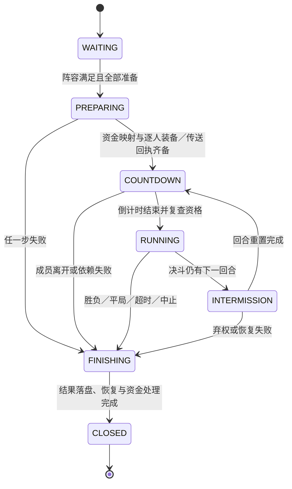

# Regions 架构

2026-09-22 补充：`MatchAdmission` 以玩家 UUID→比赛 UUID 原子占位，三类比赛服务共同使用；
延迟释放只删除对应比赛的占位，各玩法 escrow 仍各自持有装备真相。
竞速／捉迷藏锁定本局场地定义，准备阶段等待回执并设 10 秒上限；战斗／竞速等待异步传送完成。
装备恢复先保存玩家数据再确认和删除记录，死亡玩家在重生后重试。验证见 [本轮证据](completion-2026-09-22.md)。

## 数据流

`RegionSource` 解析外部或 Cuboid 几何；`RegionRegistry` 保存运行时已发布定义；`RegionPublishingService` 管理 draft、revision、preview、publish 和 rollback。`RegionDetectionService` 在实体调度器上检测玩家所在区域，并交给 `RegionOverlapResolver` 选择主 Mode、Flag、Effect 和 Trigger 来源。

检测发生在每次跨方块移动上，因此按来源分组处理：已发布集合只在 `RegionStorage.publishedRevision()` 变化时重建，来源可用性每次查询只判定一次，每个来源通过 `RegionSource.containing` 一次解析整批引用。`LandsRegionSource` 借此把同一位置的多个 Lands 场地折叠成一次反射解析。

`RegionSessionService` 维护玩家会话并协调 Mode 与 Effect。Flag 由监听器在事件发生时查询；Trigger 通过 Action/Condition 注册表执行；所有配置在发布前由 `RegionValidationService` 和 capability schema 校验。

`RegionTrigger` 的每个枚举项都必须有运行时触发点：`RegionsPlugin.verifyCapabilityCatalog` 在启动时比对枚举与已注册的 TRIGGER descriptor，不一致直接拒绝启用，避免出现「能保存、能校验、永不触发」的配置。

## 状态所有权

- `ScopedEffectService` 是 Regions 临时属性、药水、飞行、发光和隐身抑制的唯一所有者。每次应用都会记录原值和 scope；lease 原子写入 `effect-escrow.yml`。`scale` 与 `allow_flight` 还通过玩家 PDC 中的 CubeX lease 栈和其他内嵌插件协调，移除非顶层 lease 不会覆盖仍生效的控制方。一次解析出的整组 Effect 合并为一次 escrow 写入，任一失败则整组回滚，玩家不会停留在半应用状态。
- 没有可取消事件的 `deny` Flag 由 `RegionOverlapResolver` 合成对应 Effect 再交给 `ScopedEffectService` 托管：`fly: deny` 合成 `allow_flight=false`，`vanish: deny` 合成 `invisibility_suppression`。这类合成 Effect 遵循与 Flag 相同的豁免（`regions.bypass.flags`），且不与创造/旁观模式的飞行争夺控制权。`pvp`、`item_drop`、`item_pickup`、`commands` 由监听器取消事件，不需要 lease。
- `CombatModeService`（M3 起是委托 `CombatMatchCoordinator` 的薄 facade）与 `RoundModeService` 在修改装备前把快照原子写入各自 escrow。死亡、退出、强制结束、reload、停服后重启/登录都可恢复。
- `RaceModeService`、`RoundModeService` 和 `CombatModeService` 的任务闭包持有具体 state 实例。任务执行时重新核对实例，避免旧任务污染新局。
- 模式结束时区域进入 ending 状态；在线玩家的结束恢复完成后才允许下一局。
- `RewardFundingService` 是 Regions 的跨插件资金协调边界。它只持有
  `reward-funding.yml` operation lease，不持有钱；Contract 通过 provider-owned
  `ContractEscrowService` 独占 WAGER、Vault、退款和争议状态。

### 判定时序与保护（2026-09-13 补）

- **结算观察窗口**：成员变化后不立刻判胜负，先等 200 毫秒（4 tick）把同一批死亡／退出事件收齐再判定；窗口内重复触发只排一次。没有它，范围伤害同归于尽会被读成"谁后死谁输"。
- **单调时钟**：回合超时、离场宽限与观察窗口走 `System.nanoTime()`（构造时可注入，测试用假时钟推进），墙钟被 NTP 校正时判定不跟着跳；落盘时间戳仍用 `System.currentTimeMillis()`。
- **准备屏障超时**：屏障自身有上限（`preparing-seconds`，默认 10 秒），实体任务没回来时点名未回执的玩家并撤销开赛。
- **恢复期闸门**：只要还有任何一场的待恢复记录，报名就被拒绝并说明原因——避免新局的托管覆盖旧快照。
- **临时装备防转移**：托管期间禁止丢弃与拾取（`CombatModeService.isGearEscrowed` 同时覆盖战斗与回合两种托管），使恢复快照始终与场上物品一致。
- **FINISHING 进度可见**：结算期间告知参与者还有几人待恢复与资金状态，每恢复一人刷新一次。

## 玩法共用层（2026-09-19）

八种玩法里有七种是"比赛"。它们此前分属三套互不相干的实现，同一个概念有三种行为
（装备键在战斗层生效、在捉迷藏半生效、在竞速完全不生效）。共用部分现在收在
`org.cubexmc.regions.mode` 下，战斗层的 `org.cubexmc.regions.match` 继续负责它自己的状态机。

| 组件 | 职责 | 使用者 |
| --- | --- | --- |
| `ModeParameterSchema` | 每种玩法自己的参数表，一律严格校验。玩法注册、能力目录与参数表读同一份清单。 | `BuiltInRegionCapabilities`、`RegionsPlugin`、`RegionsCommand` |
| `ModeRoster` | 显式报名册：报名／准备／取消准备／退出／观战／淘汰顺序，阶段沿用 `MatchPhase`。 | 竞速、捉迷藏 |
| `ModeGearEscrow` | 崩溃安全的托管协议：peek → 写回 → 落盘确认 → 删记录。`confirmed` 标记让宕机停在两步之间时只补清理，不覆盖新背包。 | 竞速、捉迷藏 |
| `ModeKit` | 唯一一份装备发放与快照写回实现（`kit` / `armor` / `offhand`）。 | 三类玩法 |
| `ModeDamagePolicy` | 竞速与捉迷藏的成员隔离（伤害 + 药水／滞留云），纯判定不碰实体。 | `PlayerLifecycleListener` |
| `RaceCourse` | 赛道纯逻辑：载具别名与逐点约束、三个同义超时键、半径回退、开赛票数。 | `RaceModeService` |
| `MatchStore` | 每块场地最后一次比赛结果，八种玩法共用一份（插件持有）。 | 三类玩法、命令、大厅 |

`free_event` 不在其列：它没有比赛，只接受触发动作能引用的返回点。

## 比赛层（M3–M7）

`dual_pvp`、`union_war`、`free_for_all` 共用 `org.cubexmc.regions.match` 包，报名、准备、开赛、伤害、恢复与终结只有这一条实现路径。

| 组件 | 职责 |
| --- | --- |
| `CombatMatchCoordinator` | 比赛状态机：报名／退出／准备／观战、队伍选择、开赛屏障、计时、死亡与重生、离线与恢复、终结与结果。持有具体局实例（matchId／generation），拒绝旧回调。 |
| `CombatModeService` | 保留原公开 API 的薄 facade，全部调用委托协调器：`onEnter`/`onLeave`/`ready`/`forceEnd`/`onDeath`/`onRespawn`/`cleanupAll`/`restoreIfPending`/`status`/`isEnding`/`isCombatMode` 行为不变，另有 `join`/`leave`/`unready`/`spectate`/`selectTeams`/`participants`/`result`/`membership`/`damageDecision`/`recoverPersisted`/`tick`/`onDisconnect`。 |
| `MatchRules` | 纯规则：`MatchSettings`/`MatchView`/`MatchVerdict` 加上 `DuelRules`、`NationBattleRules`、`LastPlayerStandingRules`，由 `MatchRulesCatalog` 按玩法类型选择；未实现规则的玩法不会进入状态机。 |
| `CombatDamagePolicy` | 纯伤害矩阵：给定攻击者、受害者与会话状态返回允许或拒绝，不接触 Bukkit 实体。 |
| `MatchSpawns` | 点位文本（`world,x,y,z[,yaw,pitch]`，`;` 分隔）的解析与校验，含大乱斗出生点间距检查，不依赖服务器实例。 |
| `MatchStore` | 比赛元数据与**每块场地最后一次结果**落盘（`matches.yml`，schema `match-store-version: 1`）。由 `RegionsPlugin` 持有，战斗、竞速与捉迷藏写同一份，所以 `/regions game <id> result` 不必按玩法分派。 |
| `GearSnapshot` | 入场前的玩家状态快照：背包、护甲、副手、经验、游戏模式与返回点。只被 `CombatGearStore` 持有和落盘，比赛自身不保存第二份可变装备真相；新增受控状态时在此加字段并保持旧记录可读。 |

### 状态机

PREPARING 与 COUNTDOWN 都不放行伤害。`WAITING` 只接受报名与准备；`RUNNING` 的死亡、超时、退出与管理员操作走同一个终结入口，终态只记录一次。

### 三个真相来源

| 文件 | 所有者 | 内容 |
| --- | --- | --- |
| `matches.yml` | `MatchStore` | 比赛阶段、名单与队伍／Nation 快照、结果、恢复进度（八种玩法共用结果区） |
| 装备 escrow | `CombatGearStore` | 被托管的物品与受控玩家状态（`GearSnapshot`）。三类玩法各一个文件：`combat-escrow.yml`／`race-escrow.yml`／`round-escrow.yml`，但**协议只有一份**（战斗层在协调器里，另两类在 `ModeGearEscrow`）。 |
| `reward-funding.yml` | `RewardFundingStore` | Contract 资金 operation lease 与锁定证据 |

三者互不复制对方的可变数据：比赛记录不带物品副本，装备 escrow 不带资金状态，资金 lease 只带结算所需的映射与证据。`MatchStore` 同一区域同时只保留一场未收尾的比赛，未完成的上一局阻止同场新局。

### 开赛屏障与失败回滚

1. 锁定 roster 与规则 → 资金预留，并写入开赛前约定的 `Nation ID → 合同签署方` 映射。
2. 逐人持久化装备 escrow（写入失败即中止）。
3. 在每名玩家所属线程发装备并传送。
4. 收齐全部成功回执后进入 COUNTDOWN。

任何一名玩家在 2–4 步失败都会撤销整场开赛并恢复已经取走的状态，不出现部分玩家先打的情况。工会战若两个 WAGER 签署方无法唯一映射到本场两个 Nation，比赛拒绝开始。

### 比赛线程模型

玩家背包、位置、生命值与重生点只在 `CubexScheduler.runAtEntity`／区域调度器上读写；协调器在全局线程只做状态判定与编排，实体任务回传值快照。计时由倒计时任务、回合休整任务与 1 秒 tick（回合超时、5 秒离开宽限、ActionBar）组成，另保留 watchdog 兜底调用；所有任务闭包持有具体局实例，旧局计时器不能结束或修改新局。

### 恢复协议

恢复按四步执行，顺序不可交换：

1. 读取 escrow；
2. 在玩家所属线程把完整快照写回玩家（覆盖式恢复，不用 addItem 追加）；
3. 落盘“恢复已确认”标记；
4. 删除对应 escrow 记录。

重启时若发现恢复已经确认，只补做第 4 步的记录清理，不覆盖玩家之后合法获得的新背包；未确认的恢复保留待恢复，离线玩家在登录后继续。重启、reload 或崩溃恢复会中止未收尾的比赛，不自动续打半局，中断资金经既有 lease 退款。

### 伤害隔离

只有同一场比赛、同一 RUNNING 阶段、双方均存活且分属对立面时才放行 PVP。候场者、观战者、局外人与其他比赛的玩家双向拒绝（既不能打人也不能被打）。归属覆盖近战、投射物、药水与滞留云雾、宠物与玩家引燃的 TNT；玩家来源但无法安全归属的伤害按拒绝处理；生物与环境伤害不受本策略影响，环境死亡仍然淘汰。

## 线程模型

玩家/实体状态只在 `CubexScheduler.runAtEntity` 或已知安全的 Paper 主线程路径修改。全局计时器只做 state 判定和结束编排。Paper 正常停服在当前主线程同步恢复；Folia 停服不创建无法保证运行的实体任务，而是保留持久化 lease/escrow 供下次启用恢复。

## 故障模型

磁盘写入采用临时文件加原子替换（不支持时安全降级）。`regions.yml` 与 `reward-funding.yml` 先完整解析到临时快照；任一记录损坏都会使 reload 失败并保留当前内存，禁止跳过坏记录后覆盖原文件。持久化失败会回滚对应内存变更或玩家变更。Effect 组合只在整组成功后缓存签名，失败组会清理并在下一次刷新重试。审计保存发布、强制操作、模式结束和比赛结果等关键事件。

资金 lease 在调用 Contract 前写入 PREPARING/SETTLING/REFUNDING；进入 SETTLING 时先持久化比赛类型与获胜方线索，再查询 provider。Contract 暂时不可用时重启/reload 可使用同一 operation id 继续解析胜者并 settle，不会把已经结束的比赛误走退款。Contract 返回 `REVIEW_REQUIRED` 时 lease 保留，禁止自动换 operation id 重试。
